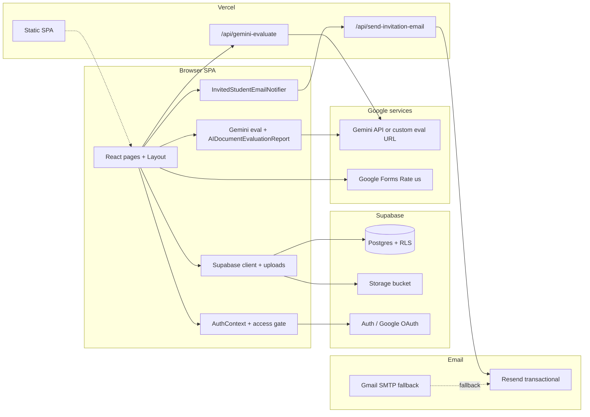

# Smart Document Evaluator

**Smart Document Evaluator** (branded in the UI as **Smart Docs Validator**) is a private academic web application for **IT332 / CS342**. Students sign in with **Google**, upload work to **Supabase Storage**, and use **Submit Work**, **Submission Status**, **Tasks** (with optional deadline reminders), **Boards**, **Calendar**, **Drive**, **Sheets**, and **Analytics**. Teachers use **Grades** (review queue), **Class List**, **Course Tasks** (publish tasks, optional handouts, due dates, delete/bulk-delete), **Student Submissions**, **Documents**, **Analytics**, **Reports**, and **Instructions/Inbox**. Optional **Google Gemini** grading runs via same-origin **`POST /api/gemini-evaluate`** (server key). Invited students may receive a branded **Resend** email on first sign-in.

> **Production:** [`https://www.smartformevaluator.com`](https://www.smartformevaluator.com) (custom domain on Vercel)  
> **Vercel default URL:** [`https://smart-document-evalutator.vercel.app`](https://smart-document-evalutator.vercel.app)

---

## Submission-ready README (final deliverables)

| Requirement | Where to find it in this file |
|-------------|------------------------------|
| **Complete tech stack** with **version / release numbers** | [Complete tech stack (with version numbers)](#complete-tech-stack-with-version-numbers) |
| **Deployment** — **frontend** (Vercel) and **backend** (Supabase + APIs + email + Gemini) | [Deployment instructions](#deployment-instructions) → [Frontend (Vercel)](#frontend-vercel) · [Backend (Supabase + Resend + Gemini)](#backend-supabase--resend--gemini) |
| **Sample / dummy usernames and passwords** for **all user types** on the **live server** | [Test accounts / sample credentials](#test-accounts--sample-credentials) · [Dummy evaluator accounts (documentation)](#dummy-evaluator-accounts-documentation) |

**Related docs (Markdown):** `docs/SRS-Smart-Document-Evaluator-v3.md`, `docs/SDD-Smart-Document-Evaluator-v3.md`, `docs/SPMP-Smart-Document-Evaluator-v3.md`, `docs/STD-Smart-Document-Evaluator-v3.md`, `docs/PRESENTATION-READINESS-AND-DELIVERABLES.md`, `docs/ERD-Smart-Document-Evaluator.md`. **PDF export:** `npm run docs:pdf:deliverables`.

---

## Table of contents

1. [Complete tech stack (with version numbers)](#complete-tech-stack-with-version-numbers)
2. [Architecture (high level)](#architecture-high-level)
3. [Features](#features)
4. [Test accounts / sample credentials](#test-accounts--sample-credentials)
5. [Database export / dump](#database-export--dump)
6. [Deployment instructions](#deployment-instructions)
   - [Frontend (Vercel)](#frontend-vercel)
   - [Backend (Supabase + Resend + Gemini)](#backend-supabase--resend--gemini)
7. [Local development quick-start](#local-development-quick-start)
8. [Environment variables](#environment-variables)
9. [NPM scripts](#npm-scripts)
10. [Project layout](#project-layout)
11. [Class list & invitation emails](#class-list--invitation-emails)
12. [Security notes](#security-notes)
13. [License](#license)

---

## Complete tech stack (with version numbers)

> Versions below are the **exact resolved versions** from `package-lock.json` (the lockfile checked into the repo). Run `npm install` to reproduce.

### Runtime / build tools

| Tool | Version | Purpose |
|------|---------|---------|
| **Node.js** | **18 LTS** (tested up to 22.x) | JavaScript runtime |
| **npm** | **10+** | Package manager (ships with Node 18+) |
| **TypeScript** | **5.6.3** | Static typing across the codebase |
| **Vite** | **5.4.21** | Dev server + production bundler |
| **PostCSS** | **8.5.14** | CSS pipeline |
| **Autoprefixer** | **10.4.20** | CSS vendor prefixes |
| **ESLint** | **9.12.0** | Linting (flat config) |
| **typescript-eslint** | **8.8.1** | TS-aware lint rules |
| **@eslint/js** | **9.12.0** | ESLint recommended JS rules |
| **eslint-plugin-react-hooks** | **5.1.0-rc** | React hook rules |
| **eslint-plugin-react-refresh** | **0.4.12** | Vite HMR safety |
| **globals** | **15.11.0** | Globals presets for ESLint |

### Frontend dependencies

| Package | Version | Purpose |
|---------|---------|---------|
| **React** | **18.3.1** | UI framework |
| **react-dom** | **18.3.1** | DOM renderer |
| **@types/react** | **18.3.11** | React types |
| **@types/react-dom** | **18.3.0** | React-DOM types |
| **react-router-dom** | **7.15.0** | Client-side routing |
| **@vitejs/plugin-react** | **4.3.2** | Vite React plugin |
| **Tailwind CSS** | **3.4.17** | Utility CSS |
| **lucide-react** | **0.344.0** | Icon set |
| **mammoth** | **1.12.0** | Browser-side `.docx` parsing |
| **@supabase/supabase-js** | **2.57.4** | Supabase browser/server SDK |

### Backend / infrastructure (managed services + serverless)

| Service / library | Version | Role |
|---|---|---|
| **Supabase Postgres** | **15.x** (managed) | App database (Row-Level-Security) |
| **Supabase Auth** | Current (Gotrue v2) | Google OAuth (PKCE) |
| **Supabase Storage** | Current | Student upload bucket |
| **Vercel Functions** | Node runtime (latest) | Serverless `api/send-invitation-email.ts`, `api/gemini-evaluate.ts` (see `vercel.json`) |
| **Resend** | API v1 | Transactional email (DKIM-signed) |
| **nodemailer** | **8.0.7** | Gmail SMTP fallback (`invite:gmail`) |
| **Google Gemini** | `gemini-2.5-flash` (configurable) | Optional AI evaluator |
| **Google Forms** | n/a | Optional Rate-us survey backend |

### CLI / dev tooling (devDependencies)

| Package | Version | Purpose |
|---------|---------|---------|
| **pg** | **8.20.0** | Postgres client for `npm run db:apply` |
| **sharp** | **0.34.5** | Mascot PNG matte removal (`npm run mascot:strip-bg`) |
| **md-to-pdf** | **5.2.4** | Markdown → PDF (`npm run docs:pdf`, `npm run docs:pdf:deliverables`) |

### Hosting / DNS

| Component | Provider | Notes |
|---|---|---|
| **Frontend hosting** | Vercel (free / Hobby) | Auto-deploys from `main` |
| **Domain registrar** | GoDaddy | Domain: `smartformevaluator.com` |
| **DNS** | Vercel nameservers (`ns1.vercel-dns.com`, `ns2.vercel-dns.com`) | Auto-issues SSL via Let's Encrypt |
| **Email DNS records** | Vercel DNS | Resend domain `send.smartformevaluator.com` (DKIM + SPF MX + SPF TXT) |

---

## Architecture (high level)



- **Single-page app (SPA)** — all routes render inside `Layout` after sign-in; role (`student` | `teacher` | `admin`) gates which routes exist.
- **Access gate** — student sign-in is restricted to the gmails in `src/data/invitedStudentEmails.ts`. Teachers / admins are whitelisted via env vars.
- **`VITE_*`** values are inlined at **build time**; **server-only** values (`GEMINI_API_KEY`, `RESEND_API_KEY`, `SMARTDOCS_FROM_EMAIL`, …) are read at request time inside **`/api/*`** only.

---

## Features

| Area | Description |
|------|-------------|
| **Authentication** | Supabase Auth with **Google OAuth** (PKCE). |
| **Roles** | `student`, `teacher`, `admin`. `VITE_ADMIN_EMAILS` / `VITE_TEACHER_EMAILS` elevate by email; everything else is a student. |
| **Class-list access gate** | Students whose Gmail isn't on the official roster are signed out immediately with a friendly message — the app shell is never mounted for unauthorized accounts. |
| **Students** | Dashboard, **Submit Work**, **Submission Status**, **Tasks** (deadline reminders), **Boards**, **Calendar**, **Drive**, **Sheets**, **Analytics**, **TEAM 14**, **Settings**. |
| **Student UX** | Floating **Rate us** button + **Eva** anime onboarding tour; **General Submission** bucket exists for quick uploads but is hidden from Tasks/workspace lists. |
| **Teachers** | Dashboard, **Grades** (review queue), **Course Tasks**, **Student Submissions**, **Documents**, **Analytics**, **Class List**, **Instructions/Inbox**, **Reports**, **Settings**, **Team 14**. |
| **AI grading (optional)** | **Run AI Evaluator** — heuristic fallback when Gemini is unavailable; otherwise structured rubric + executive summary + per-page Before/After + diagram review + multimodal (PDF / image / audio / video) attachments. |
| **Invitation emails** | Branded HTML email sent **once per user** when an invited student signs in for the first time; also bulk-sendable via CLI. |
| **Bulk actions** | Multi-select + "Delete selected" controls on class list, student submissions, grading, and submission-status pages. |
| **Stable UI** | No flicker on alt-tab or route swap; background fetches are throttled. |

---

## Test accounts / sample credentials

Sign-in is **Google OAuth only** — there is no traditional email-and-password screen. The "password" is always the Google account's own password (we never see or store it). To test the system as a particular role, you must sign into Google with an account whose email matches one of the lists below.

> ⚠️ Do not commit real passwords to git. If you need to share working credentials with an evaluator, send them out-of-band (email, encrypted message) and rotate after the evaluation window.

### Live (production) test accounts on `https://www.smartformevaluator.com`

| Role | Sign-in email (Google) | Password | Notes |
|------|------------------------|----------|-------|
| **Admin** | _(fill in your admin Gmail — must be listed in `VITE_ADMIN_EMAILS`)_ | _Google account password_ | Full access to every page and to teacher tools. |
| **Teacher** | _(fill in your teacher Gmail — must be listed in `VITE_TEACHER_EMAILS`)_ | _Google account password_ | Sees teacher Dashboard, Grading, Class list, Analytics. |
| **Student (project owner)** | `trafalgardreii@gmail.com` | _Google account password_ | On the official class list; can submit work, see AI feedback, click Rate us. |
| **Student (cohort sample)** | `anaclaireellen@gmail.com` *(or any address from `src/data/invitedStudentEmails.ts`)* | _Google account password_ | Only the owner of that Gmail can log in — share their own credentials separately. |
| **Blocked sample** | _any other Gmail_ | _Google account password_ | Should be auto-signed-out and shown: *"Smart Docs is for IT332 / CS342 students on the official class list only…"* |

### Local-dev sample roles

When running `npm run dev`, the same Google OAuth flow applies. Configure the role-mapping env vars in your `.env`:

```bash
VITE_ADMIN_EMAILS=alice.admin@gmail.com
VITE_TEACHER_EMAILS=bob.teacher@gmail.com,carol.teacher@gmail.com
```

Any Gmail not in those lists, but listed in `src/data/invitedStudentEmails.ts`, signs in as a **student**.

### Dummy evaluator accounts (documentation)

There is **no username/password login** in the app — **Google OAuth only**. For a written “dummy” row in your binder, use **placeholders** and create matching **Google test users** yourself (or use real roster accounts):

| Role | Dummy email (example) | Password (who sets it) | How to enable on production |
|------|------------------------|-------------------------|-------------------------------|
| **Admin** | `admin.evaluator@gmail.com` | The password **you** set on that Google account | Add the exact address to **`VITE_ADMIN_EMAILS`** in Vercel → redeploy. |
| **Teacher** | `teacher.evaluator@gmail.com` | Same | Add to **`VITE_TEACHER_EMAILS`**. |
| **Student** | `student.evaluator@gmail.com` | Same | Add the Gmail to **`src/data/invitedStudentEmails.ts`** + mirror in **`api/send-invitation-email.ts`** allow-list → deploy. |

**Blocked / negative test:** use any Gmail **not** on the lists above — the app should refuse access after OAuth.

### Convenience: how to add a temporary evaluator account

1. Edit `src/data/invitedStudentEmails.ts` — add the evaluator's Gmail (alphabetical).
2. Mirror the same Gmail in the server-side allow-list at the top of `api/send-invitation-email.ts`.
3. Commit + push → Vercel auto-deploys.
4. The evaluator can now sign in at `https://www.smartformevaluator.com` with their Google account.

To grant **teacher** access instead, add the Gmail to **Vercel → Settings → Environment Variables → `VITE_TEACHER_EMAILS`** (comma-separated), then redeploy.

---

## Database export / dump

The latest schema lives in [`docs/`](docs/) (per-feature SQL files). To export a **complete dump** of the live Supabase database (schema **and** data), use the bundled helper:

   ```bash
# 1. Set DATABASE_URL (Supabase → Project Settings → Database → Connection string)
$env:DATABASE_URL = "postgresql://postgres.<ref>:<PASSWORD>@db.<ref>.supabase.co:5432/postgres"

# 2. Generate the dump (requires pg_dump on PATH)
npm run db:dump                       # full: schema + data
npm run db:dump -- --schema-only      # schema only
npm run db:dump -- --data-only        # data only
npm run db:dump -- --out=path\to\custom.sql
```

Output is written to **`db-dumps/smart-docs-<UTC-timestamp>.sql`** (folder created if missing). See [`db-dumps/README.md`](db-dumps/README.md) for restore instructions.

> 📄 **Why isn't the dump committed to git?** It contains real student PII (emails, submissions, scores). The `db-dumps/` folder is gitignored. Share the file out-of-band (USB, encrypted Drive folder, email attachment) with whoever needs the snapshot. Submit a freshly generated dump with each deliverable.

### Installing `pg_dump`

| OS | Command |
|----|---------|
| **Windows** | Install **PostgreSQL Command Line Tools** from <https://www.postgresql.org/download/windows/> (untick "PostgreSQL Server", keep "Command Line Tools"). Make sure `pg_dump --version` works in a new terminal. |
| **macOS** | `brew install libpq && brew link --force libpq` |
| **Linux (Debian/Ubuntu)** | `sudo apt-get install postgresql-client` |

### Schema-only reference

If you only need the canonical schema (no data), the files under [`docs/`](docs/) make a self-contained schema dump:

| File | Purpose |
|------|---------|
| [`docs/supabase-setup-all-in-one.sql`](docs/supabase-setup-all-in-one.sql) | Consolidated bootstrap (recommended starting point) |
| [`docs/supabase-bootstrap-public-users.sql`](docs/supabase-bootstrap-public-users.sql) | `public.users` table + auth trigger |
| [`docs/supabase-users-table.sql`](docs/supabase-users-table.sql) | Standalone `users` table definition |
| [`docs/supabase-assignments-submissions-core.sql`](docs/supabase-assignments-submissions-core.sql) | Assignments + submissions core schema |
| [`docs/supabase-storage-student-submissions.sql`](docs/supabase-storage-student-submissions.sql) | Bucket + policies for student uploads |
| [`docs/supabase-rls-*.sql`](docs/) | All RLS policies (per-feature) |
| [`docs/supabase-fix-users-rls-recursion.sql`](docs/supabase-fix-users-rls-recursion.sql) | Hotfix for recursive RLS on `users` |

---

## Deployment instructions

The system is deployed in two halves:

- **Frontend** = a static SPA bundle on **Vercel** (auto-deploys from GitHub).
- **Backend** = managed services (Supabase + Resend + optional Gemini) + one Vercel serverless function for transactional email.

### Frontend (Vercel)

1. **Push the repo to GitHub**

   ```bash
   git remote add origin https://github.com/<you>/<repo>.git
   git push -u origin main
   ```

2. **Import the repo on Vercel** at <https://vercel.com/new>. Pick the GitHub repo, accept the auto-detected **Vite** preset (Build command `npm run build`, Output `dist`).

3. **Set environment variables** in **Vercel → Project → Settings → Environment Variables**. Apply each to all three environments (**Production**, **Preview**, **Development**):

   | Key | Example value |
   |-----|---------------|
   | `VITE_SUPABASE_URL` | `https://<ref>.supabase.co` |
   | `VITE_SUPABASE_ANON_KEY` | `eyJhbGciOi…` |
   | `VITE_ADMIN_EMAILS` | `admin@example.com` |
   | `VITE_TEACHER_EMAILS` | `teacher1@example.com,teacher2@example.com` |
   | `VITE_SUBMISSION_STORAGE_BUCKET` | `student-submissions` |
   | `VITE_GEMINI_API_KEY` *(optional, dev only)* | `AIza…` |
   | `VITE_GEMINI_MODEL` *(optional)* | `gemini-2.5-flash` |
   | `GEMINI_API_KEY` | `…` *(server secret for `/api/gemini-evaluate`; never `VITE_`)* |
   | `RESEND_API_KEY` | `re_…` |
   | `SMARTDOCS_FROM_EMAIL` | `Smart Docs <noreply@send.smartformevaluator.com>` |
   | `SMARTDOCS_APP_URL` | `https://www.smartformevaluator.com` |
   | `SMARTDOCS_SURVEY_URL` *(optional)* | Google Form URL |

4. **Custom domain** (optional, but used in production): **Vercel → Domains → Add** `smartformevaluator.com` and `www.smartformevaluator.com`. Vercel will print the two nameservers to set at your registrar:

   ```
   ns1.vercel-dns.com
   ns2.vercel-dns.com
   ```

   At **GoDaddy** (or your registrar) → **DNS → Nameservers → Change Nameservers → "Enter my own nameservers"** → paste the two above → **Save**. Vercel will auto-detect within 5–30 minutes, mark the domain green, and issue SSL via Let's Encrypt.

5. **SPA + serverless routing** is already configured in [`vercel.json`](vercel.json):

   ```json
   { "rewrites": [{ "source": "/((?!api/).*)", "destination": "/index.html" }] }
   ```

   This rewrites all non-API routes to `index.html` (so React Router can take over) while letting `/api/*` resolve to serverless functions.

6. **Trigger the first deploy** (push any commit, or click **Redeploy** in Vercel). Confirm the build log ends with "Production: Ready" and the assigned `*.vercel.app` URL works.

7. **Smoke test**:

   ```bash
   curl -I https://<project>.vercel.app                       # → 200
   curl -I https://www.smartformevaluator.com                 # → 200 (after DNS propagates)
   curl -sX POST https://<project>.vercel.app/api/send-invitation-email   # → 405 or 400 (function is reachable)
   ```

### Backend (Supabase + Resend + Gemini)

#### 1. Supabase project

1. Create a Supabase project at <https://supabase.com/dashboard>.
2. **Authentication → Providers → Google** → enable, paste a Google OAuth Client ID + Secret (from <https://console.cloud.google.com/apis/credentials>). Authorised redirect URI for the OAuth client:
   ```
   https://<ref>.supabase.co/auth/v1/callback
   ```
3. **Authentication → URL Configuration**:
   - **Site URL:** `https://www.smartformevaluator.com`
   - **Redirect URLs** (add all):
     ```
     https://www.smartformevaluator.com/**
     https://smartformevaluator.com/**
     https://<your-vercel-project>.vercel.app/**
     http://localhost:5173/**
     ```
4. **Database → SQL Editor** → run [`docs/supabase-setup-all-in-one.sql`](docs/supabase-setup-all-in-one.sql) (creates `public.users`, assignments, submissions, RLS policies). If your fresh project has a stricter `auth.users` trigger, also run [`docs/supabase-bootstrap-public-users.sql`](docs/supabase-bootstrap-public-users.sql) and [`docs/supabase-fix-users-rls-recursion.sql`](docs/supabase-fix-users-rls-recursion.sql).  
   **Optional (Course Tasks):** after assignments exist, run [`docs/supabase-assignments-handout.sql`](docs/supabase-assignments-handout.sql) and [`docs/supabase-assignments-document-type-add-std.sql`](docs/supabase-assignments-document-type-add-std.sql) if you need handout columns and **STD** on tasks.
5. **Storage → Create bucket** → `student-submissions` (private). Then in the SQL editor run [`docs/supabase-storage-student-submissions.sql`](docs/supabase-storage-student-submissions.sql).
6. **Project Settings → API** → copy the **Project URL** into `VITE_SUPABASE_URL` and the **anon public key** into `VITE_SUPABASE_ANON_KEY` (back in Vercel env vars).

#### 2. Resend (transactional email)

> Walkthrough: [`docs/INVITATION_EMAIL_SETUP.md`](docs/INVITATION_EMAIL_SETUP.md)

1. Sign up at <https://resend.com> (free tier: 100 emails/day, 3 000/month).
2. **Domains → Add Domain** → `send.smartformevaluator.com` → **Manual setup**. Resend prints 3 DNS records (1 DKIM TXT, 1 SPF MX, 1 SPF TXT).
3. Add those 3 records in **Vercel → Domains → smartformevaluator.com → DNS Records** (using the exact `Name`, `Type`, `Value`, and `Priority=10` for the MX row).
4. Back in Resend, click **"I've already added the records"**. The badge flips to **Verified** within 5–30 min. If it sticks on Pending for over an hour, delete + re-add the domain in Resend — the DKIM key is stable per account so the existing DNS rows usually still work.
5. **API Keys → Create API Key** → copy the `re_…` value → paste into **Vercel env var `RESEND_API_KEY`**.
6. Set **`SMARTDOCS_FROM_EMAIL`** to a verified-domain address, e.g.:
   ```
   Smart Docs <noreply@send.smartformevaluator.com>
   ```
7. Redeploy in Vercel so the serverless function picks up the new env vars.

#### 3. Google Gemini (optional)

Two options:

| Option | When | How |
|--------|------|-----|
| **Direct REST (dev only)** | Local `npm run dev` | Get a key at <https://aistudio.google.com/app/apikey>; set `VITE_GEMINI_API_KEY` + optional `VITE_GEMINI_MODEL` in `.env`. |
| **Built-in Vercel proxy (recommended)** | Production on Vercel | Add **`GEMINI_API_KEY`** (server secret, not `VITE_`) in Vercel → Environment Variables and redeploy. The built app calls same-origin **`POST /api/gemini-evaluate`** — the key never ships in the JS bundle and Google “HTTP referrer” restrictions cannot block your custom domain or `*.vercel.app`. |
| **Custom proxy** | Any host | Set `VITE_GEMINI_EVAL_URL` to an HTTPS endpoint that accepts `POST { docType, content, template, attachments?, model? }` and returns the same JSON shape as Gemini. |

Without a dev key or production `GEMINI_API_KEY`, the AI evaluator still loads — it falls back to a heuristic rubric draft generated in the browser (often ~2% on PDFs with no extracted text).

#### 4. Google Forms (optional — Rate us survey)

- Survey content: [`docs/SoftwareUsabilitySurvey-StudentRateUs.md`](docs/SoftwareUsabilitySurvey-StudentRateUs.md)
- Auto-generator (Apps Script): [`scripts/google-forms/create-rate-us-form.gs`](scripts/google-forms/create-rate-us-form.gs) — paste into <https://script.google.com>, run `createSmartDocsValidatorSurvey`, copy the form URL into `VITE_STUDENT_RATE_US_URL`.

#### 5. Verify everything

```bash
npm run verify:env             # checks Supabase env vars
npm run verify:gemini          # optional Gemini connectivity test
npm run invite:test            # sends one Resend test email
```

---

## Local development quick-start

```bash
git clone https://github.com/<you>/Smart_Document_Evaluator.git
cd Smart_Document_Evaluator
npm install

# 1. Copy and fill env (use the values from your Supabase project)
cp .env.example .env                # Windows: copy .env.example .env

# 2. Validate
npm run verify:env

# 3. Apply Supabase schema (one-time, requires DATABASE_URL in .env)
npm run db:apply
npm run db:fix-rls                  # only if profile loads fail at sign-in

# 4. Run
npm run dev
```

Open <http://localhost:5173>. In Supabase **Authentication → URL Configuration** add `http://localhost:5173/**` under **Redirect URLs** so Google sign-in works locally.

---

## Environment variables

### Client (build-time, prefixed `VITE_*`)

| Variable | Required | Purpose |
|----------|----------|---------|
| `VITE_SUPABASE_URL` | **Yes** | Supabase project URL |
| `VITE_SUPABASE_ANON_KEY` | **Yes** | Publishable anon key (RLS must protect data) |
| `VITE_ADMIN_EMAILS` | No | Comma-separated emails → `admin` role |
| `VITE_TEACHER_EMAILS` | No | Comma-separated emails → `teacher` role |
| `VITE_STUDENT_EMAIL_DOMAINS` | No | Restrict which domains resolve as students |
| `VITE_SUBMISSION_STORAGE_BUCKET` | No | Storage bucket for uploads (default `student-submissions`) |
| `VITE_STUDENT_RATE_US_URL` | No | Override URL for the student **Rate us** button |
| `VITE_GEMINI_EVAL_URL` | No | Optional custom POST proxy (same JSON contract as Gemini) — overrides the built-in `/api/gemini-evaluate` path |
| `VITE_GEMINI_API_KEY` | No | **Local dev only** — calls Google from the browser; visible in the built JS bundle |
| `VITE_GEMINI_MODEL` | No | Model id (e.g. `gemini-2.5-flash`) — sent to `/api/gemini-evaluate` and used for direct dev calls |

### Server-only (Vercel Function — **never** prefixed with `VITE_`)

| Variable | Used by | Purpose |
|----------|---------|---------|
| `GEMINI_API_KEY` | `api/gemini-evaluate.ts` | Google AI Studio key for teacher **Run AI Evaluator** (production builds call this route; key never ships to the browser) |
| `RESEND_API_KEY` | `api/send-invitation-email.ts` | Resend API key (`re_…`) |
| `SMARTDOCS_FROM_EMAIL` | `api/send-invitation-email.ts` | Verified-domain From address |
| `SMARTDOCS_APP_URL` | `api/send-invitation-email.ts` | URL the "Open Smart Docs" button in the email points to |
| `SMARTDOCS_SURVEY_URL` | `api/send-invitation-email.ts` | URL of the Rate us Google Form |

### CLI-only (your machine — never commit)

| Variable | Used by | Purpose |
|----------|---------|---------|
| `DATABASE_URL` | `db:apply`, `db:fix-rls`, `db:dump` | Direct Postgres connection string |
| `GMAIL_USER` | `invite:gmail` | Sender Gmail address |
| `GMAIL_APP_PASSWORD` | `invite:gmail` | 16-char Google App Password ([create one](https://myaccount.google.com/apppasswords)) |
| `GMAIL_FROM_NAME` | `invite:gmail` | Display name (default `Smart Docs`) |
| `INVITE_BATCH_GAP_MS` | `invite:send-all` / `invite:gmail` | Gap between sends in ms (default 350 / 1500) |

---

## NPM scripts

| Script | Purpose |
|--------|---------|
| `npm run dev` / `npm start` | Vite dev server (port **5173**) |
| `npm run build` | Production build → `dist/` |
| `npm run preview` | Serve `dist/` locally |
| `npm run lint` | ESLint |
| `npm run typecheck` | TypeScript check (`tsconfig.app.json`) |
| `npm run verify:env` | Validate `.env` shape for Supabase |
| `npm run verify:gemini` | Optional Gemini connectivity test |
| `npm run db:apply` | Apply SQL schema files (needs `DATABASE_URL`) |
| `npm run db:fix-rls` | Apply users RLS recursion fix SQL |
| `npm run db:dump` | Export the full Supabase database to `db-dumps/*.sql` (needs `pg_dump`) |
| `npm run supabase:setup` | Interactive Supabase setup helper |
| `npm run supabase:fix-rls` | Interactive RLS fix helper |
| `npm run mascot:strip-bg` | Regenerate `public/mascot/eva-welcome-nobg.png` (uses **sharp**) |
| `npm run invite:test` | Send one test invitation email via Resend |
| `npm run invite:send-all` | Bulk-send invitation emails via Resend to the entire class list |
| `npm run invite:gmail` | Bulk-send via Gmail SMTP fallback (Nodemailer) |
| `npm run docs:pdf` | Merge `README.md` + `DEPLOY.md` + all `docs/*.md` → `docs/pdf/Smart-Docs-Validator-Documentation-Bundle.pdf` |
| `npm run docs:pdf:deliverables` | SRS / SDD / SPMP / STD / presentation checklist → separate PDFs in `docs/pdf/` |

---

## Project layout

```
.
├── api/
│   ├── send-invitation-email.ts        ← Vercel serverless: Resend transactional email
│   └── gemini-evaluate.ts              ← Vercel serverless: Gemini proxy (production AI key)
├── db-dumps/                           ← Generated SQL dumps (gitignored)
│   └── README.md                       ← How to dump / restore
├── docs/                               ← SQL bootstrap, RLS, storage policies, SRS, setup guides
├── public/                             ← Static assets, mascot PNGs
├── scripts/
│   ├── lib/invitationEmailTemplate.mjs ← Shared HTML/text template for CLI scripts
│   ├── send-invitation-email-test.mjs  ← npm run invite:test
│   ├── send-invitation-email-bulk.mjs  ← npm run invite:send-all (Resend)
│   ├── send-invitation-email-gmail.mjs ← npm run invite:gmail (Nodemailer + Gmail SMTP)
│   ├── dump-supabase-database.mjs      ← npm run db:dump
│   ├── apply-supabase-schema.mjs       ← npm run db:apply
│   ├── build-docs-pdf.mjs              ← npm run docs:pdf
│   ├── build-deliverable-pdfs.mjs      ← npm run docs:pdf:deliverables
│   ├── check-env.mjs                   ← npm run verify:env
│   ├── test-gemini.mjs                 ← npm run verify:gemini
│   ├── remove-mascot-white-matte.mjs   ← npm run mascot:strip-bg
│   ├── gen-it332-roster-snippet.mjs    ← roster TS code generator
│   └── google-forms/create-rate-us-form.gs  ← Apps Script (paste at script.google.com)
├── src/
│   ├── App.tsx                         ← Routes + access gate; AccessGateScreen while verifying
│   ├── components/
│   │   ├── Layout.tsx                  ← shell + Rate us + Eva + InvitedStudentEmailNotifier
│   │   ├── Sidebar.tsx
│   │   ├── AIDocumentEvaluationReport.tsx
│   │   ├── UserAvatar.tsx
│   │   ├── student/
│   │   │   ├── StudentRateUsButton.tsx
│   │   │   ├── StudentOnboardingTour.tsx
│   │   │   ├── StudentDeadlineReminders.tsx
│   │   │   └── InvitedStudentEmailNotifier.tsx   ← headless: triggers /api/send-invitation-email
│   │   └── teacher/
│   │       ├── TeacherWorkspaceChrome.tsx
│   │       ├── TeacherSubmissionRosterTable.tsx
│   │       └── TeacherViewScoreModal.tsx
│   ├── context/AuthContext.tsx         ← session, role, OAuth, campus + class-list gates
│   ├── data/
│   │   ├── invitedStudentEmails.ts     ← 45 gmails authorized to sign in
│   │   ├── it332Sem2ClassRoster.ts     ← personalized first/last names for the greeting
│   │   └── team14.ts
│   ├── lib/
│   │   ├── supabase.ts                 ← browser Supabase client
│   │   ├── geminiDocumentEvaluation.ts ← Gemini / proxy evaluation + parsing
│   │   ├── geminiAttachments.ts        ← multimodal inlineData parts
│   │   ├── sendInvitationEmail.ts      ← client → /api/send-invitation-email (once per user)
│   │   ├── classRosterCache.ts
│   │   ├── studentEmailPolicy.ts
│   │   ├── studentWorkspaceData.ts
│   │   └── teacherSubmissionLoad.ts
│   ├── pages/
│   │   ├── Login.tsx
│   │   ├── student/                    ← Dashboard, Assignments, Submissions, Tasks, Team14, …
│   │   └── teacher/                    ← Dashboard, ReviewQueue, TeacherCourseAssignments, Team14, …
│   └── types/index.ts
├── vercel.json                         ← /api/* passthrough + SPA rewrite
├── DEPLOY.md                           ← Long-form deployment walkthrough
└── README.md (this file)
```

---

## Class list & invitation emails

Smart Docs is currently a **private build for the IT332 / CS342 cohort**. The class list lives in one file:

```
src/data/invitedStudentEmails.ts   ← 45 gmail addresses (alphabetised)
```

### The access gate (`src/context/AuthContext.tsx`)

After Google sign-in completes, the gate runs three checks. Any failure → immediate `signOut` and a friendly message on `/login`:

1. **`rejectStudentIfWrongCampusEmail`** — if `VITE_STUDENT_EMAIL_DOMAINS` is configured, students must sign in with a campus email.
2. **`rejectIfNotInvitedStudent`** — students must be on `INVITED_STUDENT_GMAILS`. Teachers / admins are exempt.
3. The app shell (Layout, sidebar, routes) is **only mounted after both checks pass** — unauthorized accounts see only a brief "Verifying access" screen.

### Inviting a new student

1. Edit `src/data/invitedStudentEmails.ts` (and optionally add a row in `src/data/it332Sem2ClassRoster.ts` for a personalized greeting).
2. Mirror the same gmail in the server-side allow-list at the top of `api/send-invitation-email.ts`.
3. Commit + push → Vercel redeploys.
4. Send the email: `npm run invite:send-all -- --only=newstudent@gmail.com`.

### Sending invitation emails

| Command | What it does |
|---------|--------------|
| `npm run invite:send-all` | Bulk-send via **Resend** to every student in `INVITED_STUDENT_GMAILS`. Supports `--only=`, `--skip=`, `--dry-run`. Requires `RESEND_API_KEY` + verified `SMARTDOCS_FROM_EMAIL`. |
| `npm run invite:test` | Send one test email to a single recipient. |
| `npm run invite:gmail` | Same bulk send, but over **Gmail SMTP** using Nodemailer (no Resend domain needed). Requires `GMAIL_USER` + `GMAIL_APP_PASSWORD`. |

All three CLIs share the same HTML/text template (`scripts/lib/invitationEmailTemplate.mjs`), so the email is identical regardless of channel.

---

## Security notes

- **Anon key + RLS** — the Supabase anon key is safe in the browser only when **Row Level Security** is enabled on every table and storage policy. Never expose the **service role** key or `DATABASE_URL` in the client.
- **Gemini** — on Vercel, set **`GEMINI_API_KEY`** (server-only). The app calls **`/api/gemini-evaluate`** so the key is never in the client bundle and Google API key referrer rules cannot break production while localhost still works with `VITE_GEMINI_API_KEY`. Optionally set **`VITE_GEMINI_EVAL_URL`** to your own HTTPS proxy instead.
- **Resend** — `RESEND_API_KEY` is a **server-only** variable. It lives in Vercel env vars (not prefixed with `VITE_`) and is read only inside `api/send-invitation-email.ts`.
- **Gmail App Password** — never commit, never share, never paste in the browser. Only used on the developer's machine for the SMTP fallback.
- **Student uploads** — use a dedicated bucket with policies scoped to the authenticated user (see storage SQL in `docs/`).
- **Class-list source of truth** — the gate is enforced both in the client (`AuthContext.rejectIfNotInvitedStudent`) and on the server (`api/send-invitation-email.ts` allow-list). Keep the two lists in sync.
- **Database dumps** — files in `db-dumps/` contain real student PII. The folder is gitignored; share dumps out-of-band only.

---

## License

Private / unlicensed unless you add a `LICENSE` file. Update this section when you publish the project publicly.
-
