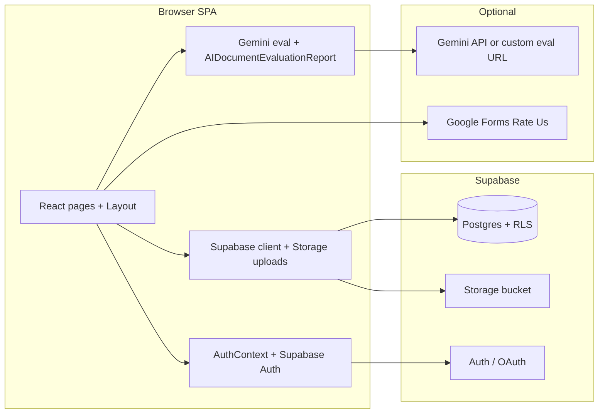

# Smart Document Evaluator

**Smart Document Evaluator** (branded in the UI as **Smart Docs Validator**) is a web application for **course document workflows**: students sign in with Google, open assignments, upload submissions to **Supabase Storage**, and track grades and AI feedback; teachers use a **grading / review queue**, class roster tools, analytics, and optional **Google Gemini**–assisted rubric inspection with long-form output (executive summary, per-page before/after, document overview, diagram evaluation).

---

## Tech stack

| Layer | Technology |
|--------|------------|
| **Runtime** | [Node.js](https://nodejs.org/) 18+ (LTS recommended) |
| **Framework** | [React 18](https://react.dev/) |
| **Language** | [TypeScript](https://www.typescriptlang.org/) 5.x |
| **Bundler / dev server** | [Vite](https://vitejs.dev/) 5 |
| **Routing** | [React Router](https://reactrouter.com/) 7 |
| **Styling** | [Tailwind CSS](https://tailwindcss.com/) 3 + [PostCSS](https://postcss.org/) + [Autoprefixer](https://github.com/postcss/autoprefixer) |
| **Icons** | [Lucide React](https://lucide.dev/) |
| **Auth & backend** | [Supabase](https://supabase.com/) — Auth (Google OAuth, PKCE), Postgres, Row Level Security, Storage |
| **Client SDK** | [`@supabase/supabase-js`](https://github.com/supabase/supabase-js) |
| **Document text** | [`mammoth`](https://github.com/mwilliamson/mammoth.js) (`.docx` → HTML/text for inspection) |
| **AI (optional)** | [Google Gemini](https://ai.google.dev/) via REST (`generativelanguage.googleapis.com`) or your own **`VITE_GEMINI_EVAL_URL`** proxy |
| **Lint / types** | ESLint 9, `typescript-eslint`, `tsc --noEmit` |
| **Deploy** | [Vercel](https://vercel.com/)–oriented (`vercel.json`, SPA rewrites); see [`DEPLOY.md`](DEPLOY.md) |

**Dev-only tooling:** [`sharp`](https://sharp.pixelplumbing.com/) is used only for the `npm run mascot:strip-bg` script (PNG matte removal). It is not loaded in the browser bundle.

---

## Frontend

The frontend is a **client-rendered SPA** that lives entirely in `src/`. There is no Node.js web server in this repo — the static build in `dist/` is what gets deployed.

| Concern | How it works |
|---------|---------------|
| **App shell** | `src/App.tsx` registers routes inside `BrowserRouter`; `src/components/Layout.tsx` renders the sidebar, mobile header, student-only **Rate us** pill, and the **Eva** onboarding tour. |
| **Routing** | [React Router 7](https://reactrouter.com/) with a single pathless `<Route element={<Layout />}>`. Role is computed in `AuthContext`; `student` and `teacher`/`admin` see different route trees. Legacy paths (`/schedule`, `/deliverables`, …) redirect to current ones. |
| **State / data fetching** | React hooks + the [Supabase JS client](https://supabase.com/docs/reference/javascript) called directly from page/component code. No Redux/Zustand/React-Query. Per-flow caches (e.g. `classRosterCache`, `geminiAttachments`) live in `src/lib/`. |
| **Auth context** | `src/context/AuthContext.tsx` wraps the app, runs the OAuth (PKCE) code exchange (`exchangeOAuthCodeOnce`), enforces student email-domain policy, and derives the `student` / `teacher` / `admin` role from Supabase plus optional env email lists. |
| **Forms / inputs** | Native HTML + Tailwind. Validation lives next to the page. Toasts and modals are local components. |
| **Styling** | [Tailwind CSS](https://tailwindcss.com/) (`tailwind.config.js`, `postcss.config.js`), brand colors `#84001B` (maroon) and `#ffd21a` (yellow), [Lucide React](https://lucide.dev/) icons. |
| **Document inspection** | `.docx` is read in the browser with [Mammoth](https://github.com/mwilliamson/mammoth.js) (`src/lib/docxText.ts`). PDFs / images / audio / video are not parsed client-side — they are uploaded to Supabase Storage and (when grading) shipped as `inlineData` to Gemini through `src/lib/geminiAttachments.ts`. |
| **AI report UI** | `src/components/AIDocumentEvaluationReport.tsx` renders rubric scores, executive summary, key strengths/gaps, verified excerpts, **per-page Before → After**, **document overview & scoring**, **visual & diagram evaluation**, and language fixes. |
| **Student UX extras** | `StudentRateUsButton.tsx` (floating Google Form / in-app modal) and `StudentOnboardingTour.tsx` (the **Eva** anime guide with typewriter steps). |
| **Performance** | Vite code-splits per route; `lucide-react` is excluded from prebundling (`vite.config.ts`) to avoid huge dev preloads. |
| **Build output** | `npm run build` emits a static SPA into `dist/`. The host (Vercel + `vercel.json`, Netlify + `public/_redirects`) must rewrite unknown routes to `index.html`. |

**Frontend folders at a glance**

```
src/
├─ App.tsx                      ← routes
├─ components/
│   ├─ Layout.tsx               ← shell + mounts Rate us + Eva (student-only)
│   ├─ Sidebar.tsx              ← role-aware nav
│   ├─ AIDocumentEvaluationReport.tsx
│   ├─ SubmissionOpenLink.tsx
│   ├─ student/
│   │   ├─ StudentRateUsButton.tsx
│   │   ├─ StudentOnboardingTour.tsx
│   │   └─ StudentWorkspaceChrome.tsx
│   └─ teacher/
│       ├─ TeacherWorkspaceChrome.tsx
│       ├─ TeacherSubmissionRosterTable.tsx
│       └─ TeacherViewScoreModal.tsx
├─ context/AuthContext.tsx      ← session, role, OAuth
├─ lib/                         ← Supabase client + domain helpers (see Backend)
├─ pages/
│   ├─ Login.tsx
│   ├─ student/                 ← Dashboard, Assignments, Submissions, …
│   └─ teacher/                 ← Dashboard, ReviewQueue, Analytics, …
└─ types/index.ts
```

---

## Backend

There is **no custom backend service** in this repo. The “backend” is composed of **Supabase** for data, auth, and files plus optional **Google services** for AI grading and survey feedback. Everything the client needs is reached over HTTPS using the public anon key, with **Row Level Security** enforcing access.

### 1) Supabase (primary backend)

| Component | Role |
|----------|------|
| **Auth** | Google OAuth (PKCE). The browser receives a session, `AuthContext` rehydrates it, and protected routes only render once a session exists. |
| **Postgres** | App tables: `public.users` (profile + role), submissions, roster data, etc. Schemas and policies live in [`docs/`](docs/) — start with [`docs/supabase-setup-all-in-one.sql`](docs/supabase-setup-all-in-one.sql). |
| **Row Level Security (RLS)** | Required. Without RLS, the anon key would expose all rows. See [`docs/supabase-fix-users-rls-recursion.sql`](docs/supabase-fix-users-rls-recursion.sql) if profile loads fail at sign-in. |
| **Storage** | Bucket for student uploads (default name `student-submissions`, configurable via `VITE_SUBMISSION_STORAGE_BUCKET`). Policy SQL: [`docs/supabase-storage-student-submissions.sql`](docs/supabase-storage-student-submissions.sql). |
| **Realtime / Edge Functions** | Not used today; the client polls/queries directly. |

**How the client talks to Supabase**

```
Browser ──HTTPS──▶ Supabase REST/Storage  (anon key, RLS-checked per request)
       ◀──────── Postgres rows / signed file URLs / OAuth session
```

### 2) Google Gemini (optional AI backend)

The teacher Run AI Evaluator flow can call Gemini in **two modes**:

| Mode | Variable | Use it for | Notes |
|------|----------|------------|-------|
| **Server proxy (recommended in production)** | `VITE_GEMINI_EVAL_URL` | Production | POST JSON: `{ docType, content, template, attachments? }`. Response: the same JSON shape Gemini returns (`executiveSummary`, `criteria`, `languageCorrections`, `correctHighlights`, `pageRewrites`, `documentOverviewScores`, `diagramEvaluations`). Keep the real Gemini key on the server. |
| **Direct REST (dev only)** | `VITE_GEMINI_API_KEY` + `VITE_GEMINI_MODEL` | Local development | The browser calls `https://generativelanguage.googleapis.com/...:generateContent`. The key ends up in the JS bundle, so **never use this in production**. |

`src/lib/geminiDocumentEvaluation.ts` handles model fallbacks (Pro / Flash / Lite), high `maxOutputTokens`, concatenating all `parts[].text`, balanced-brace JSON extraction, prompt construction, normalization, and embedding a parseable JSON tail inside `ai_draft_summary` so reports survive after publish. `src/lib/geminiAttachments.ts` packages PDFs, images, audio, and video as `inlineData` content parts.

**Without a proxy or key**, AI grading still works — it falls back to a heuristic rubric draft generated in the browser. The student/teacher UI labels this clearly.

### 3) Google Forms (optional survey backend)

The **Rate us** pill in the student portal opens the **Software Usability Feedback Survey** — a Google Form. Survey copy and structure are in [`docs/SoftwareUsabilitySurvey-StudentRateUs.md`](docs/SoftwareUsabilitySurvey-StudentRateUs.md), and [`scripts/google-forms/create-rate-us-form.gs`](scripts/google-forms/create-rate-us-form.gs) is an Apps Script that builds the entire form on your account in one run. Override the URL anytime with `VITE_STUDENT_RATE_US_URL`.

### 4) Local-only tooling under `scripts/`

These are **not** part of the runtime backend — they are Node scripts you run on a trusted machine.

| Script | Purpose |
|--------|---------|
| `scripts/check-env.mjs` | Validate `.env` shape |
| `scripts/test-gemini.mjs` | Smoke-test Gemini credentials |
| `scripts/apply-supabase-schema.mjs` | Apply SQL via `DATABASE_URL` |
| `scripts/prompt-supabase-setup.mjs`, `scripts/prompt-supabase-fix-rls.mjs` | Interactive helpers |
| `scripts/remove-mascot-white-matte.mjs` | Regenerate the transparent mascot PNG |
| `scripts/google-forms/create-rate-us-form.gs` | Apps Script to auto-build the Google Form |

### 5) Bring-your-own backend (recommended for AI)

If you want to keep Gemini keys off the browser, add a tiny HTTPS endpoint anywhere (Vercel Edge / Cloud Run / Cloudflare Workers / your own Express) that:

1. Accepts `POST` of `{ docType, content, template, attachments? }`.
2. Calls Gemini server-side with your secret key.
3. Returns the same JSON shape the client expects.

Point the app at it with **`VITE_GEMINI_EVAL_URL`**. No other changes needed in this repo.

---

## Architecture (high level)



- **Single-page app (SPA)** — all routes render inside `Layout` after login; role (`student` | `teacher` | `admin`) gates which routes exist.
- **Environment variables** — any `VITE_*` value is inlined at **build time**; production hosts must set the same keys in their build environment (never rely on a committed `.env` in production).

---

## Features

| Area | Description |
|------|-------------|
| **Authentication** | Supabase Auth with **Google OAuth** (PKCE). Unauthenticated users are sent to `/login` with query string preserved for the OAuth code. |
| **Roles** | `student`, `teacher`, `admin`. Optional `VITE_ADMIN_EMAILS` / `VITE_TEACHER_EMAILS` (comma-separated) elevate by email; profiles live in `public.users`. |
| **Students** | Dashboard, **Submit work** (`/assignments`), **My Submissions**, tasks, boards, calendar, drive, sheets, analytics, team page, settings. |
| **Student UX** | Floating **Rate us** (opens your Google Form URL or in-app fallback), **Eva** onboarding tour (first visit + replay from **Tour**). |
| **Teachers** | Dashboard, **grading** (`/grading` — review queue), student submissions, documents, analytics, class list, instructions/inbox, settings; legacy paths redirect (see `src/App.tsx`). |
| **AI grading (optional)** | **Run AI Evaluator** on submissions: heuristic fallback if Gemini is unavailable; with Gemini — structured JSON including rubric, executive summary, language fixes, verified highlights, **per-page before/after**, **document overview & scoring**, **visual & diagram evaluation**; multimodal attachments (PDF, images, audio, video) via `inlineData` when configured. |
| **Persistence** | AI draft extras can be stored in `ai_draft_summary` (parseable JSON tail) for student-facing reports after publish. |

---

## Prerequisites

- **Node.js** 18+ (LTS recommended)
- A **Supabase** project: Auth (Google provider), Postgres + RLS, Storage bucket for submissions (see `docs/`)
- (Optional) **Google Gemini** API key (dev only in browser) or a **server-side eval proxy**
- (Optional) **Google Form** URL for the student **Rate us** survey

---

## Quick start

1. **Clone and install**

   ```bash
   git clone <your-repo-url>
   cd Smart_Document_Evalutator
   npm install
   ```

2. **Environment**

   ```bash
   cp .env.example .env   # Windows: copy .env.example .env
   ```

   Set at least **`VITE_SUPABASE_URL`** and **`VITE_SUPABASE_ANON_KEY`**. All variables are documented in [`.env.example`](.env.example).

3. **Validate env**

   ```bash
   npm run verify:env
   ```

4. **Run the dev server**

   ```bash
   npm run dev
   ```

   Default: **http://localhost:5173** (see `vite.config.ts`). Add this origin (and `http://localhost:5173/**`) under Supabase **Authentication → URL Configuration** so Google sign-in works locally.

5. **(Optional) Gemini smoke test**

   ```bash
   npm run verify:gemini
   ```

---

## Environment variables (summary)

| Variable | Required | Purpose |
|----------|----------|---------|
| `VITE_SUPABASE_URL` | Yes | Supabase project URL |
| `VITE_SUPABASE_ANON_KEY` | Yes | Publishable anon key (RLS must protect data) |
| `VITE_ADMIN_EMAILS` | No | Comma-separated emails → `admin` role |
| `VITE_TEACHER_EMAILS` | No | Comma-separated emails → `teacher` role |
| `VITE_STUDENT_EMAIL_DOMAINS` | No | Restrict which domains resolve as students |
| `VITE_SUBMISSION_STORAGE_BUCKET` | No | Storage bucket for uploads (default `student-submissions`) |
| `VITE_STUDENT_RATE_US_URL` | No | Override URL for the student **Rate us** button (defaults to your form if set in code) |
| `VITE_GEMINI_EVAL_URL` | No | **Preferred in production** — POST proxy that returns the same JSON shape as Gemini |
| `VITE_GEMINI_API_KEY` | No | **Dev only** — key is visible in the built JS bundle |
| `VITE_GEMINI_MODEL` | No | Model id (e.g. `gemini-2.5-flash`); see `geminiDocumentEvaluation.ts` for fallbacks |
| `DATABASE_URL` | No | **Local only** — for `npm run db:apply` / `db:fix-rls`; never commit |

---

## NPM scripts

| Script | Purpose |
|--------|---------|
| `npm run dev` / `npm start` | Vite dev server (port **5173**) |
| `npm run build` | Production build → `dist/` |
| `npm run preview` | Serve `dist/` locally |
| `npm run lint` | ESLint |
| `npm run typecheck` | TypeScript check (`tsconfig.app.json`) |
| `npm run verify:env` | Validate `.env` shape for Supabase |
| `npm run verify:gemini` | Optional Gemini connectivity test |
| `npm run db:apply` | Apply SQL schema (needs `DATABASE_URL`) |
| `npm run db:fix-rls` | Apply users RLS recursion fix SQL |
| `npm run supabase:setup` | Interactive Supabase setup helper |
| `npm run supabase:fix-rls` | Interactive RLS fix helper |
| `npm run mascot:strip-bg` | Regenerate `public/mascot/eva-welcome-nobg.png` from `eva-welcome.png` (uses **sharp**) |

---

## Database & storage

SQL and docs live under [`docs/`](docs/). Useful entry points:

| File | Purpose |
|------|---------|
| [`docs/supabase-setup-all-in-one.sql`](docs/supabase-setup-all-in-one.sql) | Consolidated bootstrap |
| [`docs/supabase-bootstrap-public-users.sql`](docs/supabase-bootstrap-public-users.sql) | `public.users` and related |
| [`docs/supabase-storage-student-submissions.sql`](docs/supabase-storage-student-submissions.sql) | Bucket + policies for student uploads |
| [`docs/supabase-fix-users-rls-recursion.sql`](docs/supabase-fix-users-rls-recursion.sql) | Fix recursive RLS on `users` if sign-in profile loads fail |
| [`docs/SoftwareUsabilitySurvey-StudentRateUs.md`](docs/SoftwareUsabilitySurvey-StudentRateUs.md) | Software usability survey copy + Google Form wiring |
| [`docs/SRS-Smart-Document-Evaluator.md`](docs/SRS-Smart-Document-Evaluator.md) | Product / requirements notes |

**Apply SQL from a trusted machine** (requires `DATABASE_URL` in `.env` — never commit it):

```bash
npm run db:apply
npm run db:fix-rls
```

---

## Google Forms (survey + script)

- **Survey content & wiring:** [`docs/SoftwareUsabilitySurvey-StudentRateUs.md`](docs/SoftwareUsabilitySurvey-StudentRateUs.md)
- **Apps Script to auto-create the form in your Google account:** [`scripts/google-forms/create-rate-us-form.gs`](scripts/google-forms/create-rate-us-form.gs) — paste into [script.google.com](https://script.google.com), run `createSmartDocsValidatorSurvey`, copy the published URL into `VITE_STUDENT_RATE_US_URL` if you do not bake a default into the app.

---

## Deployment

- **Do not commit `.env`.** Hosted builds need the same `VITE_*` variables in the host’s environment; they are baked into the client at build time.
- Step-by-step (Vercel, SPA rewrites, OAuth URLs): **[`DEPLOY.md`](DEPLOY.md)**.
- This repo includes [`vercel.json`](vercel.json) for a Vite SPA.
- [`CNAME`](CNAME) in the repo documents a custom domain target (`www.smartformevaluator.com`); adjust for your own DNS.

---

## Project layout

| Path | Role |
|------|------|
| `src/App.tsx` | Router, auth gate, teacher vs student routes |
| `src/components/Layout.tsx` | Shell: sidebar, mobile header, student-only **Rate us** + **Eva** tour |
| `src/context/AuthContext.tsx` | Session, profile, OAuth, student email policy |
| `src/lib/supabase.ts` | Supabase browser client |
| `src/lib/geminiDocumentEvaluation.ts` | Gemini / proxy evaluation, parsing, persisted AI draft extras |
| `src/lib/geminiAttachments.ts` | Build multimodal `inlineData` parts for Gemini (PDF, images, etc.) |
| `src/lib/teacherSubmissionLoad.ts` | Teacher queue / submission types and helpers |
| `src/components/AIDocumentEvaluationReport.tsx` | Student + teacher UI for AI rubric, overview, diagrams, per-page rewrites |
| `src/pages/teacher/` | Teacher screens (grading, roster, analytics, …) |
| `src/pages/student/` | Student screens |
| `src/components/student/StudentRateUsButton.tsx` | Rate us pill + optional Google Form |
| `src/components/student/StudentOnboardingTour.tsx` | Eva mascot onboarding |
| `public/mascot/` | Mascot PNG assets |
| `scripts/` | Env checks, DB apply, Gemini test, mascot matte removal, Google Forms script |

---

## Security notes

- The **anon key** is safe in the browser only with correct **RLS** on all tables and storage policies. Never expose the **service role** key or `DATABASE_URL` in the client.
- **Gemini:** for any public deployment, use **`VITE_GEMINI_EVAL_URL`** and keep API keys on a server you control. Browser `VITE_GEMINI_API_KEY` is for local development only.
- Student uploads should use a **dedicated bucket** with policies scoped to the authenticated user (see storage SQL in `docs/`).

---

## Others

Anything that isn't strictly “frontend” or “backend” but still ships with the project:

| Topic | Where it lives | Notes |
|-------|----------------|-------|
| **Branding** | `index.html`, `public/`, `src/components/Layout.tsx` | App is branded **Smart Docs Validator** with a maroon + yellow palette. Update `<title>`, `favicon`, and any hard-coded headers if you fork. |
| **Mascot (Eva)** | `public/mascot/eva-welcome.png`, `eva-welcome-nobg.png` | Used by `StudentOnboardingTour`. Regenerate the transparent version with `npm run mascot:strip-bg`. |
| **Onboarding tour** | `src/components/student/StudentOnboardingTour.tsx` | Stores “seen” state in `localStorage`. Steps live in a `STEPS` array — edit text/icons there. |
| **Rate us survey** | `docs/SoftwareUsabilitySurvey-StudentRateUs.md`, `scripts/google-forms/create-rate-us-form.gs` | Full question bank + Apps Script generator. Override the live URL with `VITE_STUDENT_RATE_US_URL`. |
| **Custom domain** | [`CNAME`](CNAME) | Documents `www.smartformevaluator.com` as the production domain. Change this for your own DNS. |
| **Hosting config** | [`vercel.json`](vercel.json), [`DEPLOY.md`](DEPLOY.md), `public/_redirects` | SPA rewrites for Vercel and Netlify-style hosts. |
| **Docs** | [`docs/`](docs/) | SQL bootstrap, RLS fixes, storage policies, survey copy, and the SRS. Read these before deploying to a new Supabase project. |
| **Scripts** | [`scripts/`](scripts/) | All Node/Apps-Script utilities; see the Backend → *Local-only tooling* table. |
| **Build artifacts** | `dist/` | Generated by `npm run build`; never commit. Already in `.gitignore`. |
| **Type-checking** | `tsconfig*.json`, `npm run typecheck` | Strict TS via `tsc --noEmit`; CI/host build will fail on TS errors. |
| **Linting** | `eslint.config.js`, `npm run lint` | Flat ESLint 9 config with `typescript-eslint` + React hooks/refresh plugins. |
| **Accessibility** | Tailwind + native semantics | Buttons have `aria-label`s where icon-only; the Eva tour can be skipped and minimized; toasts are non-blocking. |
| **Internationalization** | English-only today | All copy is inline. Wrap with i18n if you need locales. |
| **Telemetry** | None bundled | Add your own (Plausible, PostHog, etc.) if you need analytics. |

---

## Ignored local folders

The following are listed in [`.gitignore`](.gitignore) so they are not committed:

- **`node_modules/`**, **`dist/`**, **`.env`**, editor junk
- **`.bolt/`**, **`.claude/`** — IDE / template scaffolding (not part of the app)

---

## License

Private / unlicensed unless you add a `LICENSE` file. Update this section when you publish the project publicly.
