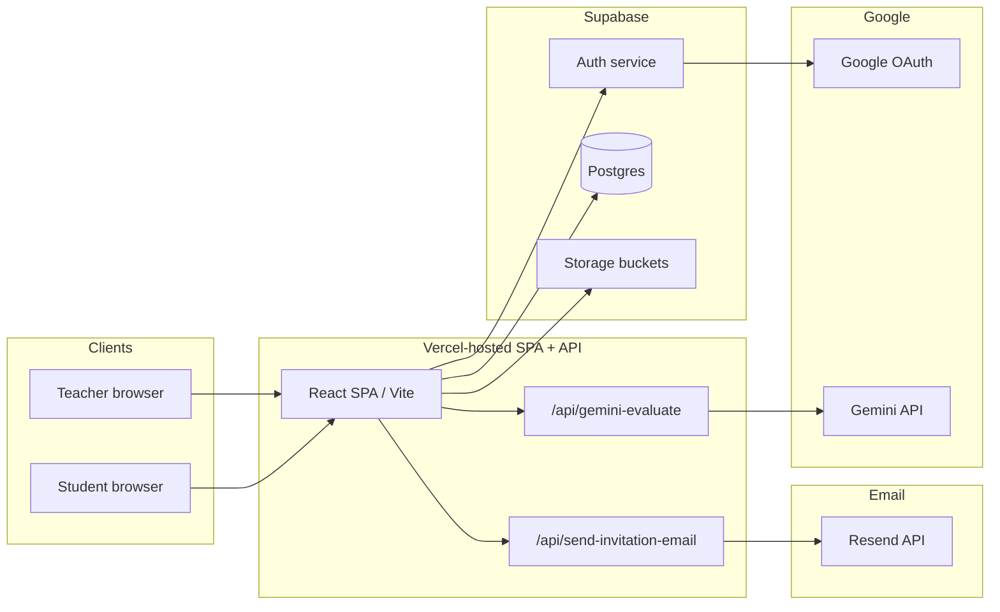
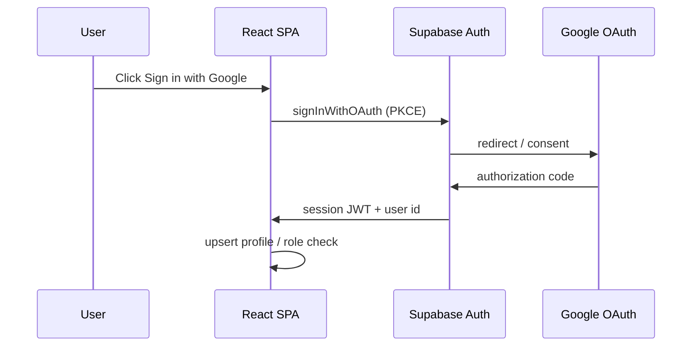
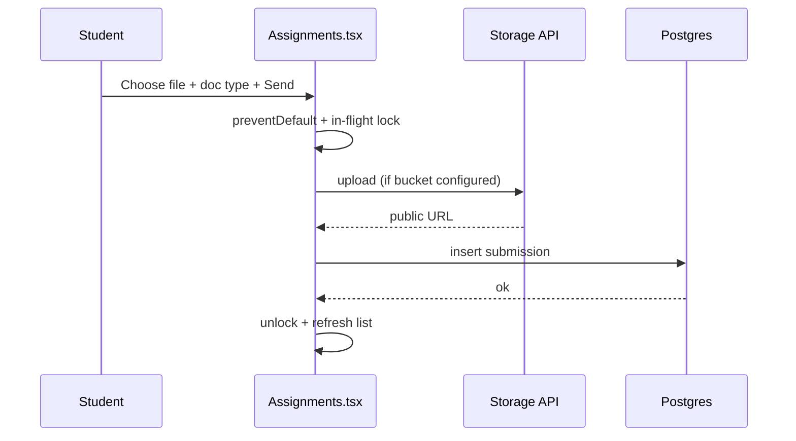
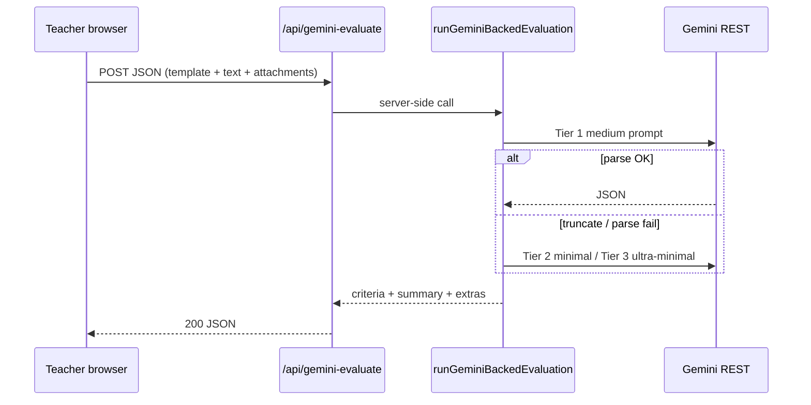
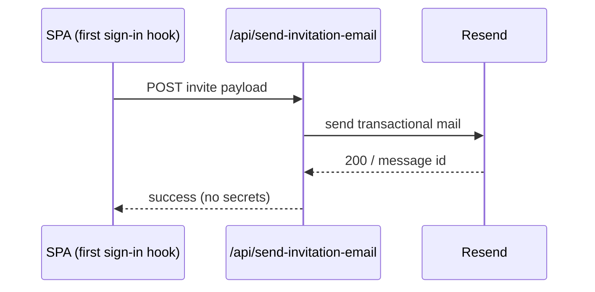
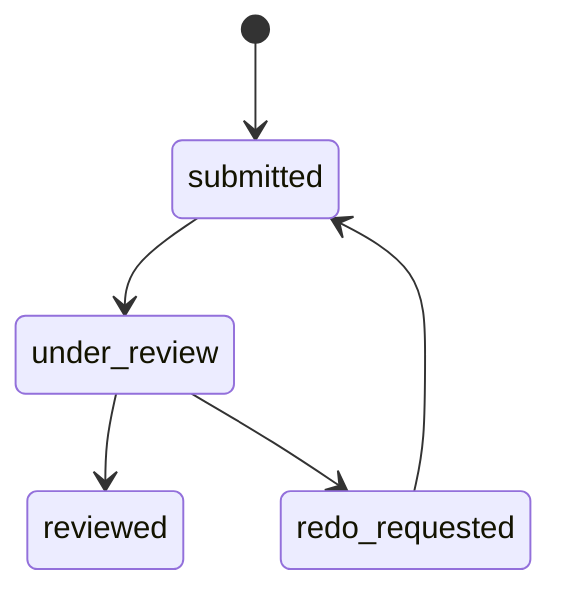

# CEBU INSTITUTE OF TECHNOLOGY – UNIVERSITY

## COLLEGE OF COMPUTER STUDIES

# Software Design Description (SDD)

**for**

# Smart Document Evaluator (Smart Docs Validator) with AI Integration

**Prepared by:**  
Alexandrei Nash Dinapo  
Jeffer Azcona  
Jushua Peter Te  
Ryan Bebiro  

**Date:** May 14, 2026  
**Version:** 3.0.1 — revised to match the deployed system (supersedes SDD v2.0 / PDF *SDD_SMARTDOCUMENTGRADER*)

---

## Change History

| Version | Date | Description | Author |
|--------|------|-------------|--------|
| 0.1 | Dec 17, 2025 | Initial SDD draft (legacy stack narrative) | Alexandrei Nash Dinapo |
| 1.0 | Dec 18, 2025 | First complete SDD | Alexandrei Nash Dinapo |
| 2.0 | Feb 21, 2026 | SDD update (still referenced Express / MySQL in places) | Alexandrei Nash Dinapo |
| **3.0** | **May 14, 2026** | **Full revision:** Replaced obsolete Node/Express/Sequelize/MySQL design with the **actual** Vite + React + TypeScript SPA, **Supabase** (Postgres + Auth + Storage), **Vercel** serverless (`/api/*`), **Resend** + SMTP invitation pipeline, **same-origin Gemini proxy**, multimodal grading (`shared/*`), teacher review (`ReviewQueue`), student quick submit hardening, and deployment on `vercel.app` + custom domain. Aligns with **SRS v2 baseline** and follow-on **SRS v3.1** (`docs/SRS-Smart-Document-Evaluator-v3.md`). | Project team |
| **3.0.1** | **May 14, 2026** | **Course Tasks subsystem:** `TeacherCourseAssignments` route, handout upload (`uploadAssignmentHandout`), optional `handout_url` / `handout_file_name` columns, student `openTask` query on Submit Work, `StudentDeadlineReminders`, workspace filter for General Submission title, bulk/single delete. See §3.8. | Project team |

---

## Table of Contents

1. [Introduction](#1-introduction)  
   1.1 [Purpose](#11-purpose)  
   1.2 [Scope](#12-scope)  
   1.3 [Definitions, Acronyms, and Abbreviations](#13-definitions-acronyms-and-abbreviations)  
   1.4 [References](#14-references)  
2. [System Context and Architectural Design](#2-system-context-and-architectural-design)  
   2.1 [High-Level Context](#21-high-level-context)  
   2.2 [Logical Layered Architecture](#22-logical-layered-architecture)  
   2.3 [Technology Stack](#23-technology-stack)  
   2.4 [Deployment Architecture](#24-deployment-architecture)  
   2.5 [Key Design Principles](#25-key-design-principles)  
3. [Detailed Design by Subsystem](#3-detailed-design-by-subsystem)  
   3.1 [Authentication, Authorization, and Class-List Gate](#31-authentication-authorization-and-class-list-gate)  
   3.2 [Student Submission and Storage](#32-student-submission-and-storage)  
   3.3 [AI Evaluation (Gemini)](#33-ai-evaluation-gemini)  
   3.4 [Teacher Review Queue and Publishing](#34-teacher-review-queue-and-publishing)  
   3.5 [Student Grade and Report Views](#35-student-grade-and-report-views)  
   3.6 [Invitation Email Pipeline](#36-invitation-email-pipeline)  
   3.7 [Analytics, Export, and Supporting Utilities](#37-analytics-export-and-supporting-utilities)  
   3.8 [Course Tasks (Teacher Publishing)](#38-course-tasks-teacher-publishing)  
4. [Data Design](#4-data-design)  
5. [Interface and Integration Design](#5-interface-and-integration-design)  
6. [Security and Privacy Design](#6-security-and-privacy-design)  
7. [Error Handling, Resilience, and Operational Concerns](#7-error-handling-resilience-and-operational-concerns)  
8. [Traceability to SRS](#8-traceability-to-srs)  

---

## 1. Introduction

### 1.1 Purpose

This Software Design Description (SDD) specifies **how** the **Smart Document Evaluator** (UI brand: **Smart Docs Validator**) is structured and implemented so that it satisfies the requirements in **`docs/SRS-Smart-Document-Evaluator-v3.md`** (v3.1 amendments) and the detailed baseline in **`docs/SRS-Smart-Document-Evaluator-v2.md`**.

It replaces outdated material in earlier SDD revisions (including the legacy **Express + Sequelize + MySQL** narrative and duplicated “Smart Form Validator” boilerplate found in the PDF export *SDD_SMARTDOCUMENTGRADER.pdf*) with the **as-built** architecture: a **Vite + React** SPA, **Supabase** backend, **Vercel** hosting and serverless functions, and **Google Gemini** accessed via a **server-side proxy** in production.

**Primary audiences:** developers maintaining the repo, deployers configuring Vercel/Supabase, course staff validating design vs. implementation, and academic reviewers.

### 1.2 Scope

This SDD covers:

- Front-end structure (pages, shared components, client libraries).
- Back-end **as implemented**: Supabase (database, auth, storage policies) and **Vercel Node-style** API routes under `api/`.
- AI grading pipeline (`shared/geminiDocumentEvaluation.ts` and related modules, `api/gemini-evaluate.ts`).
- Email invitation design (`api/send-invitation-email.ts`, `scripts/lib/invitationEmailTemplate.mjs`).
- Deployment, configuration (environment variables), and security boundaries.

**Out of scope:** formal UML for every React component, proprietary Google/Supabase internal implementation details, and institution-wide LMS integration beyond hyperlinks and CSV export.

### 1.3 Definitions, Acronyms, and Abbreviations

| Term | Definition |
|------|------------|
| **SPA** | Single-page application served from `dist/` after `vite build`. |
| **Supabase** | Managed Postgres + Auth + Storage; app uses `@supabase/supabase-js`. |
| **RLS** | Row-Level Security policies on Postgres tables. |
| **Vercel Function** | Serverless handler in `api/*.ts` exposed as HTTPS same-origin routes. |
| **Gemini proxy** | `POST /api/gemini-evaluate` — runs Gemini with `GEMINI_API_KEY` on the server; browser never needs the key in production. |
| **Eval payload** | JSON body `{ docType, content, template, attachments?, model? }` consumed by `runGeminiBackedEvaluation`. |
| **Multimodal attachment** | Base64 `inlineData` (PDF pages, images, etc.) clamped for Vercel body limits (`shared/geminiProxyPayload.ts`). |
| **AI lane / Teacher lane** | AI draft fields (`ai_draft_score`, `ai_draft_summary`) vs. official `score` / `feedback`. |
| **Resend** | Transactional email API used by `send-invitation-email`. |

### 1.4 References

- **SRS (requirements):** `docs/SRS-Smart-Document-Evaluator-v3.md` (v3.1 amendments) and `docs/SRS-Smart-Document-Evaluator-v2.md` (detailed FR baseline).
- **Repository:** `README.md`, `.env.example`, `docs/INVITATION_EMAIL_SETUP.md`, `docs/supabase-setup-all-in-one.sql` (and related SQL under `docs/`).
- **Prior SDD (superseded technical stack):** `SDD_SMARTDOCUMENTGRADER.pdf` (v2.0) — retained for change history only.
- **External:** [Gemini API](https://ai.google.dev/gemini-api/docs), [Supabase Docs](https://supabase.com/docs), [Vercel Docs](https://vercel.com/docs), [Resend Docs](https://resend.com/docs).

---

## 2. System Context and Architectural Design

### 2.1 High-Level Context

### 2.2 Logical Layered Architecture

| Layer | Responsibility | Primary location |
|-------|----------------|------------------|
| **Presentation** | Routes, modals, forms, grading UI | `src/pages/**`, `src/components/**` |
| **Application / client services** | Supabase calls, Gemini runtime resolution, submission URL resolution | `src/lib/**`, `src/context/AuthContext.tsx` |
| **Domain / AI (shared)** | Prompting, JSON parse/repair, rubric merge, persistence helpers for AI text | `shared/*.ts` |
| **Serverless API** | CORS, secrets, orchestration | `api/gemini-evaluate.ts`, `api/send-invitation-email.ts` |
| **Data** | Tables, RLS, Storage | Supabase project (see `docs/*.sql`) |

### 2.3 Technology Stack

| Concern | Technology |
|---------|------------|
| UI | React 18, TypeScript, Vite, Tailwind-style utility classes, `react-router-dom` v7 |
| Auth | Supabase Auth (Google provider), PKCE |
| Database | PostgreSQL via Supabase |
| File storage | Supabase Storage (bucket configurable via `VITE_SUBMISSION_STORAGE_BUCKET`) or inline data URL fallback under size caps |
| AI | Google Gemini (`generativelanguage.googleapis.com`), model list / fallbacks in `shared/geminiDocumentEvaluation.ts` |
| Hosting | Vercel (`vercel.json` rewrites SPA; `api/*` as functions) |
| Email | Resend (HTTP) from `api/send-invitation-email.ts`; optional Gmail SMTP in `scripts/*` |

### 2.4 Deployment Architecture

- **Build:** `npm run build` → static assets in `dist/`.
- **Routing:** Vercel rewrite sends non-API paths to `index.html` for client routing (`vercel.json`).
- **Functions:** `api/gemini-evaluate.ts` bundles `shared/**` (`includeFiles`) and may run up to **60s** (`maxDuration`).
- **Secrets:** `GEMINI_API_KEY` (and optional `VITE_GEMINI_MODEL`, `GEMINI_PROXY_EXTRA_ORIGINS`, `SMARTDOCS_APP_URL`, Resend keys, etc.) live in **Vercel Environment Variables** for the project that owns the deployment URL.
- **Custom domain:** e.g. `www.smartformevaluator.com` — must be listed in Gemini proxy origin allow-list alongside `*.vercel.app` and localhost (`api/gemini-evaluate.ts`).

### 2.5 Key Design Principles

1. **Teacher-in-the-loop:** AI produces a **draft**; publish actions write official fields.
2. **Secrets off the client in production:** Prefer `/api/gemini-evaluate` (`src/lib/geminiEvalClient.ts`).
3. **Shared evaluation logic:** Same TypeScript module runs in the browser (dev / direct key) and on Vercel (server key), avoiding drift.
4. **Defense in depth on uploads:** Client-side in-flight guard + `preventDefault` on submit forms (`src/pages/student/Assignments.tsx`) to avoid duplicate rows.
5. **Graceful AI degradation:** Tiered prompts and JSON repair in `shared/geminiDocumentEvaluation.ts` reduce fallback to heuristic scoring.

---

## 3. Detailed Design by Subsystem

### 3.1 Authentication, Authorization, and Class-List Gate

**Design intent:** Only invited cohort accounts and whitelisted staff use the app.

**Implementation:**

- `src/context/AuthContext.tsx` — session lifecycle, profile row in `public.users`, role (`student` | `teacher` | `admin`).
- Class-list gate — `src/data/invitedStudentEmails.ts` (and related checks) per SRS; sign-in blocked for unknown Gmail addresses.
- Route guards — teacher vs. student routes under `src/pages/**` with layout wrappers as applicable.

**Sequence (simplified OAuth via Supabase):**

### 3.2 Student Submission and Storage

**Modules:** `src/pages/student/Assignments.tsx`, `src/pages/student/Submissions.tsx`, `src/lib/submissionStorage.ts`, `src/lib/localSubmissionSync.ts` (when applicable).

**Upload pipeline:**

1. Student selects file + metadata (Quick submit: required **document type** label `submission_doc_type`).
2. Client optionally extracts plain text for small text-like files.
3. `resolveStudentSubmissionFileUrl` uploads to Storage **or** embeds as `data:` URL under configured max size.
4. Insert row into `submissions` (or `submission` singular variant) with `file_name`, `file_url`, `status`, optional `submission_doc_type`.

**Quick submit / Turn in UI (v3.0 behavior):**

- `submitInFlightRef` + `saving` guard prevents double POST before React re-renders disabled buttons.
- File input `ref` + clear (**X**) resets DOM value so the same file can be re-chosen after a mistake.

### 3.3 AI Evaluation (Gemini)

**Modules:**

- `shared/geminiDocumentEvaluation.ts` — prompts (`buildPrompt`, fallbacks), `runGeminiBackedEvaluation`, JSON extraction/repair, normalization, executive summary enrichment.
- `shared/geminiAttachments.ts`, `shared/geminiProxyPayload.ts`, `shared/geminiInlineTypes.ts` — attachment typing and Vercel-safe payload clamping.
- `src/lib/geminiEvalClient.ts` — `resolveGeminiEvalRuntime()` (production → same-origin proxy first).
- `api/gemini-evaluate.ts` — validates Origin, reads `GEMINI_API_KEY`, calls `runGeminiBackedEvaluation` with `evalUrl: null` (direct server key path).

**Processing flow:**

**Design notes:**

- **GET** health on same route returns `{ ok, serverKeyConfigured }` without leaking the key.
- **POST** body size managed by clamping inline attachments to stay under Vercel limits.
- **UI alignment:** `src/pages/teacher/ReviewQueue.tsx` probes readiness, passes structured props into `AIDocumentEvaluationReport`, and persists AI draft blobs per SRS.

### 3.4 Teacher Review Queue and Publishing

**Module:** `src/pages/teacher/ReviewQueue.tsx` (large stateful screen — grading modal, AI-only vs teacher lane, sessionStorage locks for AI-only flow).

**Responsibilities:**

- Load submission text + binary attachments for Gemini (`loadSubmissionAttachmentsForGemini` pattern per codebase).
- Run AI evaluation → merge into rubric UI → optional freeze (`sessionStorage`) for AI-only grading mode.
- Publish: writes `score`, `feedback`, `status`, and AI draft columns per schema.

### 3.5 Student Grade and Report Views

**Modules:** `src/pages/student/Submissions.tsx`, `src/components/AIDocumentEvaluationReport.tsx`.

**Design:** Read-only presentation of published teacher data + parsed AI extras from stored summary format (`parsePersistedAiDraftSummary` / append tail conventions in `shared/geminiDocumentEvaluation.ts`).

### 3.6 Invitation Email Pipeline

**Modules:**

- `api/send-invitation-email.ts` — Resend HTTP API, CORS, HTML + text bodies, default `SMARTDOCS_APP_URL` → **`…/login`** for “Open Smart Docs”.
- `scripts/lib/invitationEmailTemplate.mjs` + `scripts/send-invitation-email-*.mjs` — CLI parity with server template.

**Sequence:**

### 3.7 Analytics, Export, and Supporting Utilities

- **Teacher analytics:** `src/pages/teacher/Analytics.tsx` — aggregates from Supabase queries.
- **CSV export:** Implemented in teacher flows per SRS (see `ReviewQueue` / export helpers in repo).
- **Local fallback:** `localSubmissionSync` and local storage keys for offline-first dev scenarios (see code for exact behavior).

### 3.8 Course Tasks (Teacher Publishing)

**Purpose:** Teachers publish cohort-visible tasks (assignments) with optional due date and optional handout file; students consume them on **Tasks** and deep-link into **Submit Work**.

**Key modules:**

- `src/pages/teacher/TeacherCourseAssignments.tsx` — list teacher-owned rows from `assignments` (or `assignment`); create modal; close/re-open; single and bulk delete; handout file picker with clear control; custom due-date popover (date + time + OK).
- `src/lib/submissionStorage.ts` — `uploadAssignmentHandout(file, teacherId)` writes to the submissions bucket under `handouts/{teacherId}/…`.
- `src/App.tsx` — route `/course-tasks` (teacher-only).
- `src/components/Sidebar.tsx` — nav label **Course Tasks**.

**Student integration:**

- `src/lib/studentWorkspaceData.ts` — `safeFetchAssignments` selects extended columns when present; filters out **General Submission** title before exposing assignments to `useStudentWorkspace`.
- `src/pages/student/Tasks.tsx` — Turn in links to `/assignments?openTask={id}`; handout link when URL present.
- `src/pages/student/Assignments.tsx` — reads `openTask` search param, opens turn-in modal, strips param after consume.
- `src/components/student/StudentDeadlineReminders.tsx` — in-app alerts + optional `Notification` API.

**Data:** SQL migrations `docs/supabase-assignments-handout.sql`, `docs/supabase-assignments-document-type-add-std.sql`; core table definitions in `docs/supabase-assignments-submissions-core.sql` (includes `assignments_delete_own` RLS).

---

## 4. Data Design

**Authoritative schema:** apply SQL under `docs/` (e.g. `supabase-setup-all-in-one.sql`, `supabase-submissions-submission-doc-type.sql`).

**Core entities (logical):**

- **users** — mirrors auth user; `role` drives UI routing and RLS expectations.
- **assignments** — course tasks (system may auto-ensure a “general submission” bucket).
- **submissions** — `student_id`, `assignment_id`, `file_name`, `file_url`, `status`, `score`, `feedback`, `ai_draft_score`, `ai_draft_summary`, optional `submission_doc_type`.

**Submission status state machine** (simplified):

---

## 5. Interface and Integration Design

### 5.1 External APIs

| API | Direction | Purpose |
|-----|-----------|---------|
| Supabase REST / Realtime | Client → Supabase | CRUD on tables, auth session |
| Supabase Storage | Client → Supabase | Binary upload |
| Gemini `generateContent` | Server (`api/gemini-evaluate`) → Google | Grading |
| Resend | Server → Resend | Invitation email |

### 5.2 Internal “API” (Same Origin)

| Route | Method | Body / response |
|-------|--------|-----------------|
| `/api/gemini-evaluate` | GET | Health / key configured flag |
| `/api/gemini-evaluate` | POST | Eval request JSON → grading JSON |
| `/api/send-invitation-email` | POST | Invite payload → send result |

**CORS:** Gemini function validates `Origin` / `Referer` against allow-list; invitation function follows pattern documented in `api/send-invitation-email.ts`.

---

## 6. Security and Privacy Design

- **OAuth tokens:** Managed by Supabase client; not stored in custom cookies beyond SDK defaults.
- **RLS:** Enforce student ownership and teacher read policies in SQL (`docs/supabase-rls-*.sql`).
- **API keys:** `GEMINI_API_KEY` and Resend keys only on server env; students never receive Gemini secrets in production path.
- **Attachment handling:** Base64 in JSON over HTTPS; teachers should treat AI output as advisory (SRS non-functional).
- **Privacy (Philippines DPA):** Align collection and retention with institutional policy; data minimization in prompts (judge from submission only).

---

## 7. Error Handling, Resilience, and Operational Concerns

| Risk | Mitigation |
|------|------------|
| Gemini timeout / 429 | Model candidate list + retryable detection in shared Gemini client code paths |
| Truncated JSON | `repairTruncatedJson` + tiered prompts |
| Oversized POST to Vercel | `clampInlineAttachmentsForVercelProxy` |
| Missing DB columns | Feature detection + user-facing notices (e.g. `submission_doc_type`) |
| Double submit | `submitInFlightRef` + disabled buttons + `preventDefault` |
| Wrong deployment URL in email | `SMARTDOCS_APP_URL` env + `/login` suffix in templates |

---

## 8. Traceability to SRS

| SRS area (v3) | SDD section |
|---------------|-------------|
| Class-list gate & roles | §3.1 |
| Student submit / doc type | §3.2 |
| Gemini grading & teacher review | §3.3, §3.4 |
| Student-visible reports | §3.5 |
| Invitation email | §3.6 |
| CSV / analytics | §3.7 |
| NFR: security, deployability | §2.4, §5, §6, §7 |

---

## Document Control

- **Master copy (Markdown):** `docs/SDD-Smart-Document-Evaluator-v3.md` in repository root project.  
- **Export:** For submission to CIT-U, print this file to PDF from your editor or Pandoc; update the **Change History** table when the version increments.

**End of SDD v3.0**
